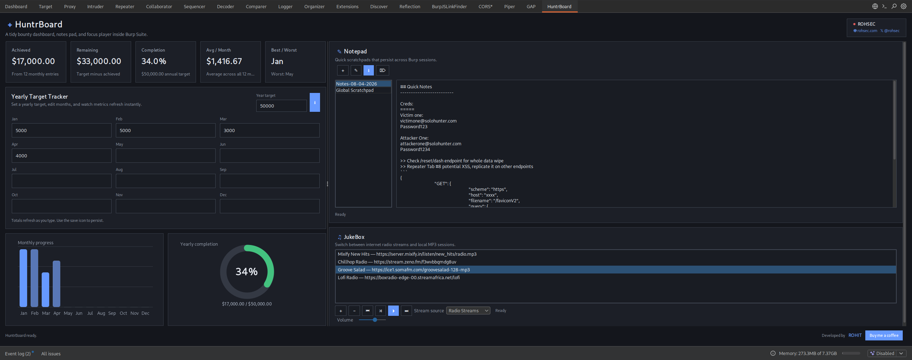

# HuntrBoard

HuntrBoard is a Burp Suite productivity extension for bug bounty hunters. It adds a polished custom tab to Burp with a target dashboard, progress visuals, persistent notes, and a compact JukeBox that supports both internet radio streams and local MP3 playback.



## Features

- Custom Burp tab built with the Montoya API
- Yearly target tracker with editable values for all 12 months
- Auto-calculated progress metrics:
  - total achieved
  - remaining target
  - percent complete
  - average per month
  - best and worst month
- Lightweight dashboard visuals:
  - monthly bar chart
  - yearly completion ring
  - summary stat cards
- Persistent Notepad with multiple note documents
- JukeBox with dual audio modes:
  - internet radio streams
  - local MP3 files
- Saved radio stream URLs with quick switching
- Persistent playlists, notes, targets, and audio preferences across Burp sessions

## JukeBox

The JukeBox supports two listening modes.

### Radio Streams
- Save named internet radio stream URLs
- Switch between saved streams inside Burp
- Shuffle and cycle through saved stations
- Radio mode is the default source

### Local MP3 Files
- Add local MP3 files into a persistent playlist
- Play, pause, previous, next, and shuffle controls
- Resume paused playback without restarting the track

## Build

```bash
./gradlew jar
```

Output JAR:

```bash
build/libs/HuntrBoard-1.0.0.jar
```

## Load into Burp Suite

1. Build the project with `./gradlew jar`
2. Open Burp Suite
3. Go to `Extensions > Installed > Add`
4. Select the generated JAR from `build/libs/`
5. Load the extension and open the `HuntrBoard` tab

## Project Structure

- `src/main/java/com/rohsec/huntrboard/HuntrBoardExtension.java` - extension entrypoint
- `model/` - application state, notes, tracker data, radio stations, and playlist models
- `persistence/` - Montoya preferences-backed state storage
- `service/` - tracker calculations and JukeBox playback logic
- `ui/` - dashboard panels, Notepad, JukeBox, charts, and styling helpers

## Tech Stack

- Java 21
- Burp Montoya API
- Gradle Kotlin DSL
- Swing UI themed for Burp
- Gson for persisted state serialization
- BasicPlayer / mp3spi for audio playback

## Status

HuntrBoard is an ongoing project and will continue to receive new features and updates.
